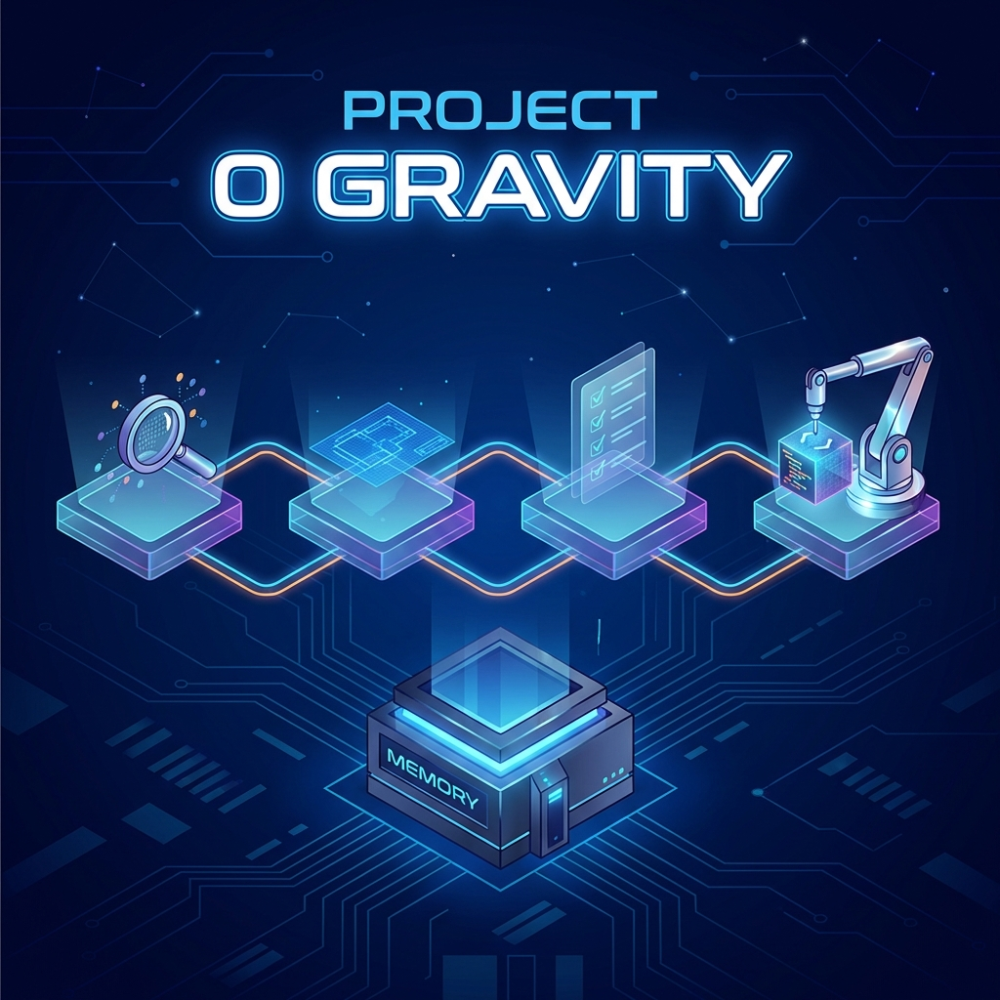

# Project 0 Gravity (P0G)



> **Turn Antigravity into a methodical software engineer that never forgets.**

[](https://opensource.org/licenses/MIT)
[](https://deepmind.google/technologies/gemini/antigravity/)

P0G is a methodology for [Google Antigravity](https://deepmind.google/technologies/gemini/antigravity/) that eliminates **Context Rot** — when the AI forgets decisions mid-project. It works by storing all state in files and enforcing a strict phase workflow, so every agent invocation starts clean and rebuilds context from disk.

---

## How It Works

P0G splits every project into 4 sequential phases. Each phase has a dedicated slash command, a specialized agent persona, and a clear output. You cannot skip phases.

```
  /p0g-np          /p0g-plan         /p0g-tasks       /p0g-loop
     │                 │                 │                │
     ▼                 ▼                 ▼                ▼
┌──────────┐     ┌──────────┐     ┌──────────┐      ┌──────────┐
│ Discovery│────▶│  Design  │────▶│  Tasks   │─────▶│ Execute  │
│          │     │          │     │          │      │          │
│ "What    │     │ "How to  │     │ "What    │      │ Backup → │
│  are we  │     │  build   │     │  to do   │      │ Code →   │
│  doing?" │     │  it?"    │     │  first?" │      │ Verify → │
└──────────┘     └──────────┘     └──────────┘      │ Log →    │
     │                 │                 │          │ Repeat   │
     ▼                 ▼                 ▼          └──────────┘
  prd.json          +stack            +tasks          code done
  created          +features         +verify cmds     all verified
```

Plus one reactive command you can use **at any time** to fix complex bugs:

```
  /p0g-surgeon → Diagnose → Decompose into micro-fixes → Apply one by one → Verify each
```

### What each phase does

| # | Command | What happens | Output |
|---|---------|--------------|--------|
| 1 | `/p0g-np` | Agent interviews you about the project (Socratic method). No code. | `prd.json` with vision, requirements, constraints |
| 2 | `/p0g-plan` | Agent designs the technical architecture with you. | `prd.json` gains stack, features, structure |
| 3 | `/p0g-tasks` | Agent breaks features into small, verifiable tasks. | `prd.json` gains tasks with verification commands |
| 4 | `/p0g-loop` | Agent executes tasks one by one: backup, code, verify, log, repeat. | Working, verified code |
| - | `/p0g-surgeon` | Agent diagnoses a bug, splits the fix into micro-operations, applies each. | Bug fixed with minimal changes |

### Recommended models

Each phase has different reasoning needs. Switch models in Antigravity's model selector before running each command.

| Command | Model | Thinking Level | Why |
|---------|-------|---------------|-----|
| `/p0g-np` | Gemini 3.1 Pro | Medium | Fluid conversation for the interview |
| `/p0g-plan` | Gemini 3.1 Pro | High | Deep reasoning for architecture decisions |
| `/p0g-tasks` | Gemini 3.1 Pro | Medium | Good analysis without latency overhead |
| `/p0g-loop` | Gemini 3 Flash | — | Tasks are atomic; speed and cost matter |
| `/p0g-surgeon` | Gemini 3.1 Pro | High then Medium | High for diagnosis, Medium for applying fixes |

---

## Install

### Option A: Install globally (do this once)

Run this once on your machine (macOS or Linux). It installs the `p0g-init` command:

```bash
curl -sSL https://raw.githubusercontent.com/yz9yt/P0G/main/install.sh | bash -s -- --global
```

Then, from **any project directory**, just run:

```bash
cd my-project
p0g-init
```

Done. Open the project in Antigravity and type `/p0g-np` to start.

### Option B: One-liner per project (no global install)

Navigate to your project directory and run:

```bash
curl -sSL https://raw.githubusercontent.com/yz9yt/P0G/main/install.sh | bash
```

This downloads P0G, copies the workflow files into your project, and cleans up. Your existing code is **never modified or deleted**.

### Option C: Install with a paradigm

P0G ships with optional paradigm templates that enforce architectural rules across all phases. Install one alongside P0G:

```bash
curl -sSL https://raw.githubusercontent.com/yz9yt/P0G/main/install.sh | bash -s -- --paradigm=functional
```

This installs P0G **plus** copies the paradigm file to `.agent/rules/`, where Antigravity loads it automatically as a persistent rule. The agent will follow functional programming principles in every phase.

Available paradigms:

| Paradigm | Flag | What it enforces |
|----------|------|------------------|
| **Functional** | `--paradigm=functional` | Pure core + imperative shell, immutable data, errors as values, effects as descriptions |

You can also add a paradigm to an existing P0G project manually:

```bash
# Copy from the P0G repo
curl -sSL https://raw.githubusercontent.com/yz9yt/P0G/main/paradigms/functional.md -o .agent/rules/functional.md
```

### What gets installed

```
your-project/
├── .agent/workflows/         ← Slash commands (what you type in Antigravity)
│   ├── p0g-np.md             ← /p0g-np (Discovery)
│   ├── p0g-plan.md           ← /p0g-plan (Architecture)
│   ├── p0g-tasks.md          ← /p0g-tasks (Task breakdown)
│   ├── p0g-loop.md           ← /p0g-loop (Execution)
│   └── p0g-surgeon.md        ← /p0g-surgeon (Bug fixer)
│
├── agents/p0g/
│   ├── prompts/              ← Agent personalities (loaded by workflows)
│   │   ├── discovery.md
│   │   ├── architect.md
│   │   ├── tasker.md
│   │   ├── executor.md
│   │   └── surgeon.md
│   └── skills/
│       └── SKILL.md          ← Backup/rollback commands
│
├── .p0g/                     ← Safety infrastructure (backups go here)
│   ├── backups/
│   ├── snapshots/
│   └── checkpoints/
│
├── AGENTS.md                 ← Coding patterns (grows as agent learns)
└── progress.txt              ← Execution log (append-only)
```

Your existing files are **never modified or deleted** by the installer.

### Manual install

If you prefer not to use the one-liner:

```bash
cd /path/to/your-project
git clone --depth 1 https://github.com/yz9yt/P0G.git .p0g-tmp
cp -r .p0g-tmp/.agent .
cp -r .p0g-tmp/agents .
cp -r .p0g-tmp/.p0g .
cp .p0g-tmp/AGENTS.md .
cp .p0g-tmp/progress.txt .
rm -rf .p0g-tmp
```

### Verify installation

Open your project in Antigravity and type `/p0g` — you should see autocomplete suggestions for all five commands.

---

## Usage

### Starting a new project

```
Step 1: Open your project in Antigravity
Step 2: Type /p0g-np
Step 3: Answer the agent's questions about your project
Step 4: Type /p0g-plan when prompted
Step 5: Type /p0g-tasks when prompted
Step 6: Type /p0g-loop to start building
```

Each command tells you what to run next when it finishes. You cannot run a later phase before the earlier ones complete.

### Example session

```
You:   /p0g-np
Agent: What problem does this project solve?
You:   "A REST API for user management"
Agent: Who are the target users?
You:   "Backend developers integrating auth"
Agent: [... more questions ...]
Agent: ✓ Discovery complete. prd.json created. Run /p0g-plan next.

You:   /p0g-plan
Agent: What tech stack do you prefer?
You:   "Node.js, Express, PostgreSQL"
Agent: [... architecture discussion ...]
Agent: ✓ Architecture defined. 4 features mapped. Run /p0g-tasks next.

You:   /p0g-tasks
Agent: ✓ 16 tasks created with verification commands. Run /p0g-loop next.

You:   /p0g-loop
Agent: [BACKUP] backup_20260220_180532.tar.gz
Agent: [START]  Task #1: Create user model schema
Agent: [VERIFY] test -f src/models/user.ts → exit 0
Agent: [DONE]   Task #1: PASSED (1/16)
Agent: [START]  Task #2: Implement registration endpoint
Agent: ...
```

### Fixing bugs with /p0g-surgeon

When something breaks, the Surgeon decomposes the fix into the smallest possible steps:

```
You:    /p0g-surgeon
Agent:  Describe the problem.
You:    "Login works but session doesn't persist after redirect"
Agent:  [TRIAGE] Integration issue, High severity
Agent:  [DIAG] Root cause: cookie sameSite='strict' blocks redirect
Agent:  [PLAN] 4 micro-fixes planned:
          S-001 [XS] Change sameSite to 'lax' (1 line)
          S-002 [XS] Add secure flag (1 line)
          S-003 [S]  Add redirect validation (5 lines)
          S-004 [S]  Update tests (8 lines)
        Proceed? [Y/N]
You:    Y
Agent:  [S-001] ✓ (1/4)
Agent:  [S-002] ✓ (2/4)
Agent:  [S-003] ✓ (3/4)
Agent:  [S-004] ✓ (4/4)
Agent:  RESOLVED — 4 micro-fixes, 15 lines changed.
```

If the agent loses context mid-surgery, re-run `/p0g-surgeon` — it detects the saved plan and resumes.

---

## How P0G prevents Context Rot

The core problem: AI assistants forget things during long sessions. After enough back-and-forth, the agent starts contradicting earlier decisions, forgets file structures, or re-introduces bugs it already fixed.

P0G solves this by storing **all state in files**:

| File | Purpose |
|------|---------|
| `prd.json` | Single source of truth: vision, features, tasks, status |
| `progress.txt` | Append-only log of everything the agent did |
| `AGENTS.md` | Coding patterns and conventions discovered during the project |
| `.p0g/backups/` | Automatic snapshots before every code change |

Every agent invocation starts by **reading these files** to rebuild context. No memory is carried between sessions — it all comes from disk. This means:

- Agent can lose context and recover by re-reading files
- Different models can work on the same project
- The project state is always inspectable and version-controllable

### Safety system

Before every code change, the agent creates a backup:

```bash
# Automatic backup (runs before every task in /p0g-loop)
.p0g/backups/backup_20260220_1805_task_T7.tar.gz
```

If something goes wrong:

```bash
# Rollback to latest backup
LATEST=$(ls -t .p0g/backups/*.tar.gz | head -n 1) && tar -xzf "$LATEST" -C .
```

---

## Core concepts

### prd.json — the single source of truth

```json
{
  "project_name": "My Project",
  "version": "0.1.0",
  "status": "ready_for_execution",
  "vision": { "elevator_pitch": "...", "problem_statement": "..." },
  "features": [
    { "id": "F1", "name": "User Auth", "priority": "must-have" }
  ],
  "tasks": [
    {
      "id": 1,
      "feature_id": "F1",
      "description": "Create user model",
      "verification_cmd": "test -f src/models/user.ts",
      "passes": false,
      "dependencies": []
    }
  ]
}
```

Status flows linearly: `discovery` → `planning` → `ready_for_execution` → `in_progress` → `completed`

### Verification commands

Every task has a shell command that returns exit code 0 on success. The agent cannot mark a task as done unless verification passes.

```bash
test -f src/models/user.ts                         # File exists
grep -q 'export class User' src/models/user.ts     # Content correct
npm test -- --grep "user model" --silent            # Tests pass
```

### Task lifecycle

```
pending → in_progress → passed      (happy path)
                      → failed → retry → passed    (auto-retry, max 3)
                               → blocked            (needs human help)
```

---

## Agents

Each phase loads a specialized agent persona from `agents/p0g/prompts/`:

| Agent | File | Role | Key trait |
|-------|------|------|-----------|
| Discovery | `discovery.md` | Requirements interviewer | Asks "why", never suggests solutions |
| Architect | `architect.md` | Technical designer | Opinionated but justified |
| Tasker | `tasker.md` | Task decomposer | "If you can't verify it, you can't ship it" |
| Executor | `executor.md` | Implementation engineer | Zero assumptions, atomic execution |
| Surgeon | `surgeon.md` | Bug fixer | Smallest possible incisions |

---

## Contributing

See [CONTRIBUTING.md](CONTRIBUTING.md) for guidelines. We welcome workflow improvements, new agent prompts, and better documentation.

---

## License

MIT License. See [LICENSE](LICENSE) for details.

---

Made with care by Albert C [@yz9yt](https://x.com/yz9yt)
